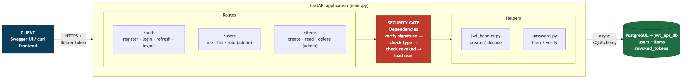
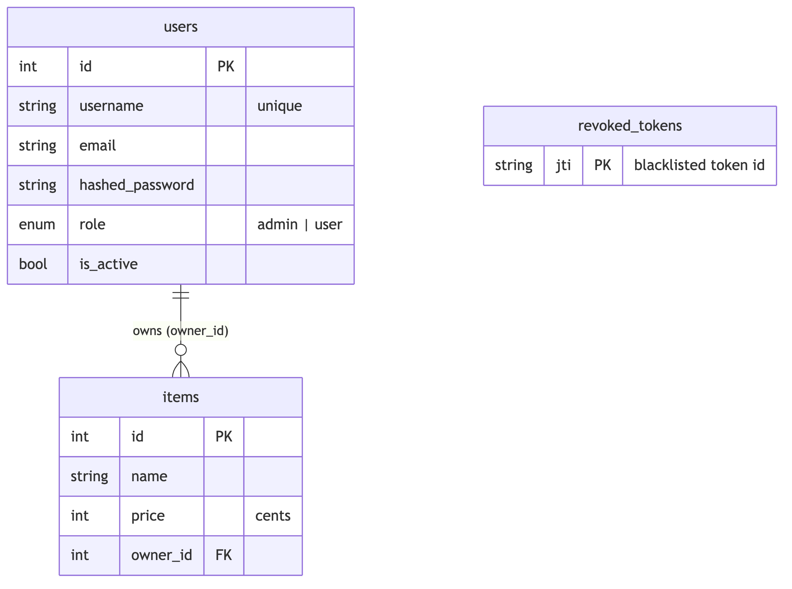
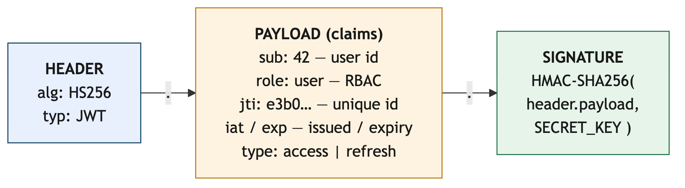
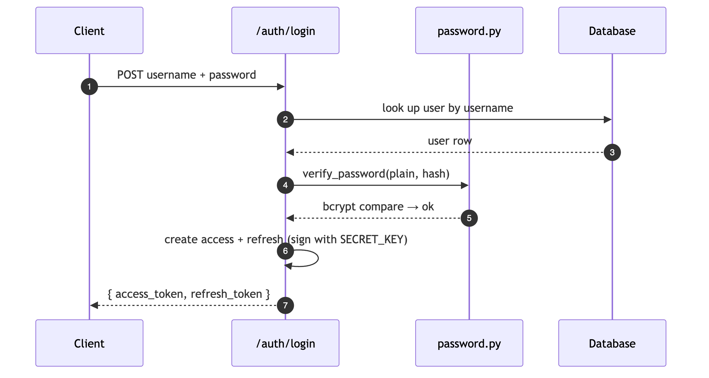
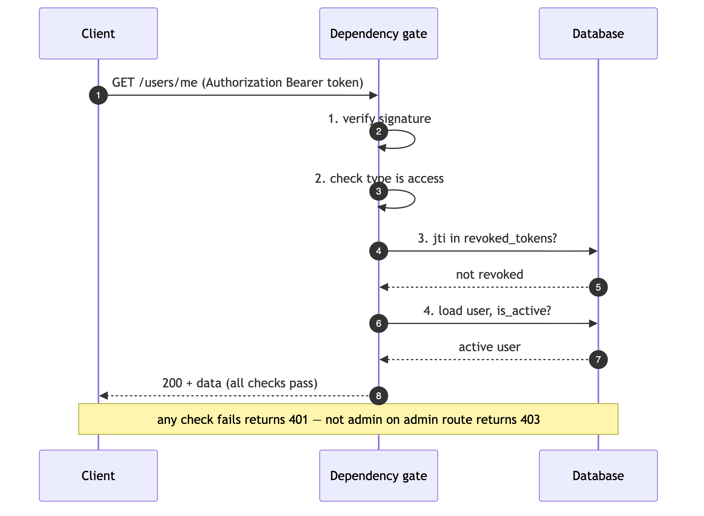
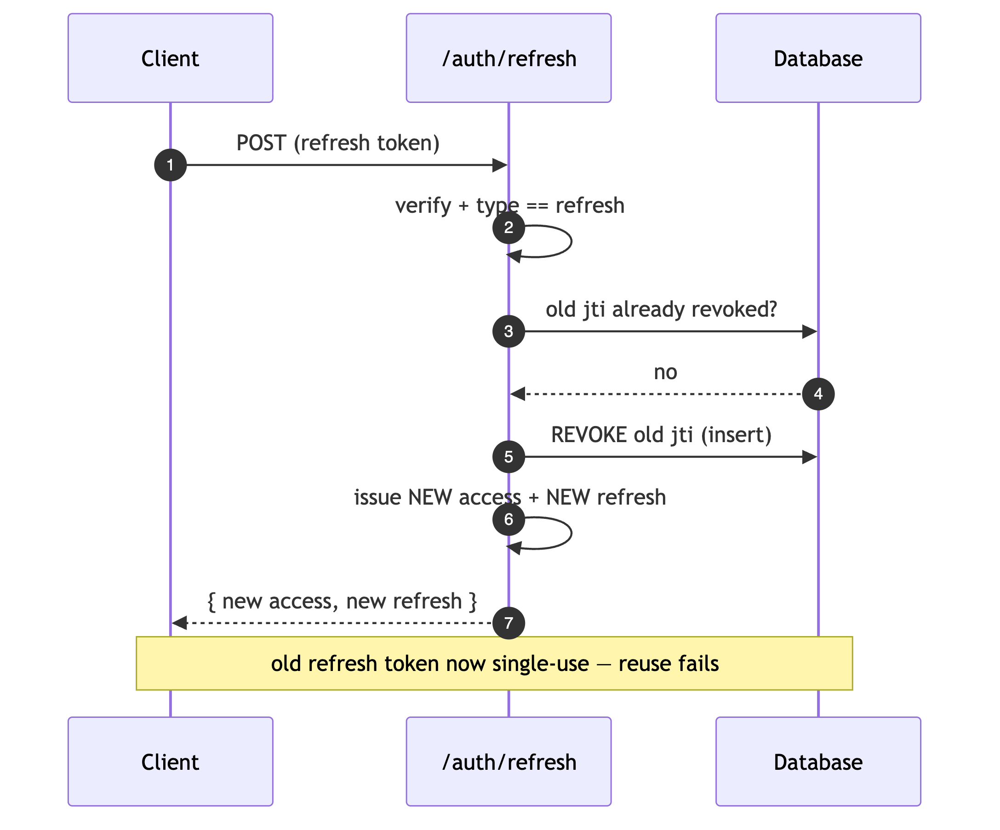
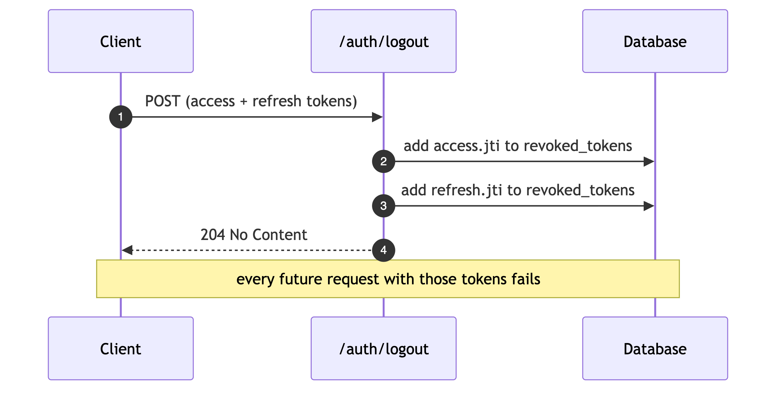
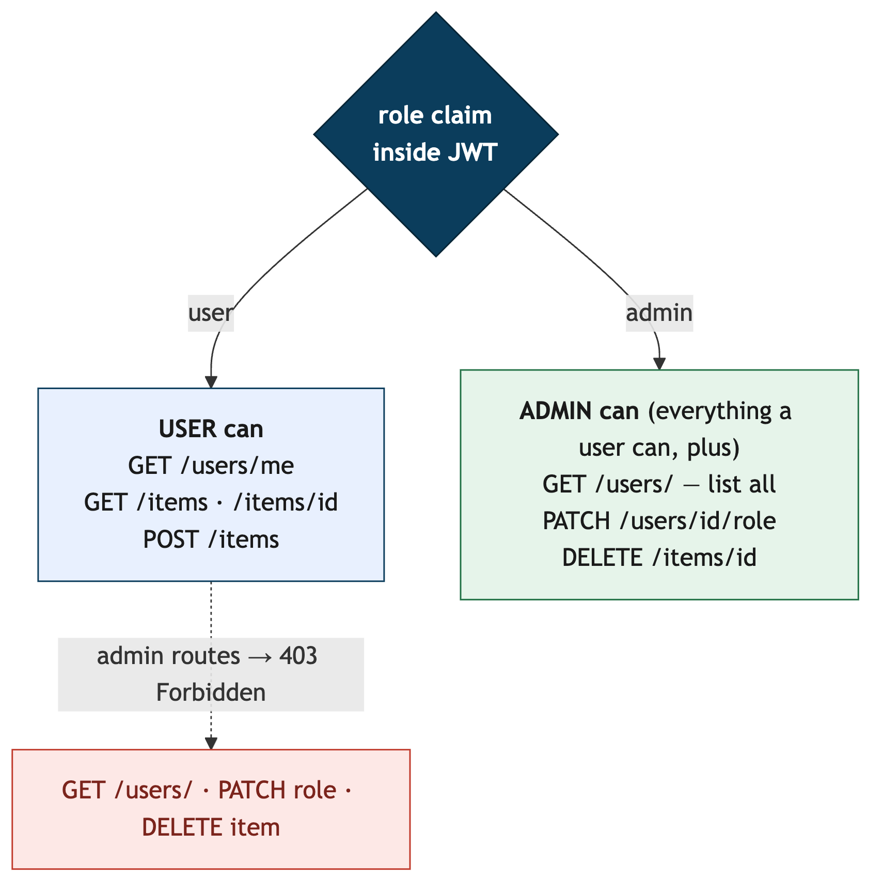

# JWT API Service — Project Report

**Course:** SEC25 — *JWT (JSON Web Token) API on a RESTful service*
**Author:** j-ahmedov
**Repository:** [github.com/j-ahmedov/jwt-api-service](https://github.com/j-ahmedov/jwt-api-service)

---

## 1. Executive summary

This project is a **RESTful web service secured with JWT authentication and
role-based access control (RBAC)**. A client authenticates once with a
username/password, receives a pair of signed tokens, and then calls protected
endpoints by presenting the token instead of credentials on every request.

The service demonstrates the full JWT lifecycle end-to-end:

- **generating** signed access & refresh tokens,
- **validating** them on every protected request,
- **authorising** actions based on a role claim carried inside the token,
- **revoking** tokens (logout and refresh rotation),

and it is **evaluated** for security, performance, and scalability.

Built with **FastAPI + async SQLAlchemy + PostgreSQL** on Python 3.12.

---

## 2. Objectives coverage (SEC25 a–e)

| # | Objective | How it is met |
|---|-----------|---------------|
| **a** | Generate & validate JWTs | `auth/jwt_handler.py` signs HS256 tokens; `decode_token()` verifies signature + shape |
| **b** | Token-based auth for endpoints | `HTTPBearer` + `get_current_user` dependency guards protected routes |
| **c** | Access control from token attributes/roles | `role` claim + `require_admin` dependency + `Role` enum |
| **d** | Integrate into a REST service | `/auth`, `/users`, `/items` routers, persisted in PostgreSQL |
| **e** | Evaluate performance/security/scalability | 26 automated tests, load benchmark, evaluation in §9–§11 |

---

## 3. Technology stack

| Layer | Technology | Purpose |
|-------|-----------|---------|
| Language | Python 3.12 | — |
| Web framework | FastAPI 0.136 | Async REST API + auto Swagger docs |
| Validation | Pydantic v2 | Request/response schema validation |
| JWT | python-jose 3.5 (HS256) | Sign / verify tokens |
| Passwords | bcrypt 5.0 | One-way salted password hashing |
| ORM | SQLAlchemy 2.0 (async) | Database access |
| Driver | asyncpg | Async PostgreSQL connection |
| Database | PostgreSQL 14 | Persistent store |
| Server | uvicorn | ASGI application server |
| Testing | pytest + httpx | 26 automated tests |

---

## 4. System architecture



The request flows left to right: the **Client** presents a Bearer token → the
**Routes** receive the HTTP call → the **Security gate** (a FastAPI dependency)
verifies the token, checks its type, checks it isn't revoked, and loads the user
→ **Helpers** do the cryptography → the **ORM** persists to PostgreSQL. Keeping
all auth logic in the single dependency gate means security is enforced in
exactly one place.

---

## 5. Data model



**Design notes**

- **`price` is stored as an integer number of cents**, not a float — this avoids
  floating-point rounding errors on money (e.g. 19.99 is stored as `1999`).
  The API converts to/from a float at the edge.
- **`role` is a database-level enum** (`admin` | `user`) — invalid roles cannot
  even be written to the table.
- **`revoked_tokens`** holds the `jti` (unique token id) of every token that has
  been logged out or rotated; it is the revocation blacklist.

---

## 6. The JWT itself

Two token types are issued at login. Both are **HS256-signed** and carry the
same claim set:



| Claim | Meaning | Why it matters |
|-------|---------|----------------|
| `sub` | Subject = user id (string per RFC 7519) | Who the token belongs to |
| `role` | `admin` / `user` | Drives access control without a DB lookup |
| `jti` | Unique token id (UUID) | Lets a single token be revoked |
| `iat` | Issued-at time | Audit / freshness |
| `exp` | Expiry time | Limits the damage of a stolen token |
| `type` | `access` or `refresh` | Prevents token-type confusion |

| Token | Lifetime | Use |
|-------|----------|-----|
| **Access** | 30 minutes | Sent on every protected request |
| **Refresh** | 7 days | Exchanged for a fresh pair; single-use |

The signature guarantees **integrity**: change any byte of the payload (e.g. to
promote yourself to `admin`) and the signature no longer matches, so the token
is rejected.

---

## 7. Authentication flows

### 7.1 Login — issuing tokens



### 7.2 Calling a protected endpoint — validating the token



If **any** of the four checks fails → `401 Unauthorized`. If the route also
requires admin and the `role` claim isn't `admin` → `403 Forbidden`.

### 7.3 Refresh rotation — one-time use



**Rotation** means the old refresh token is blacklisted the moment it is used.
A stolen-and-reused refresh token is therefore only good **once** — reuse fails
because its `jti` is now in `revoked_tokens`.

### 7.4 Logout — explicit revocation



---

## 8. Role-based access control (RBAC)



**How escalation is prevented (defence in depth):**

1. Public `POST /auth/register` **always** creates `role = user` — the field was
   removed from the request schema, so a client literally cannot ask for admin.
2. Roles can only be changed by an admin via `PATCH /users/{id}/role`.
3. An admin **cannot demote themselves** (guards against locking out the last
   admin).
4. The `role` lives inside the **signed** token — it can't be tampered with.

The first admin is created from environment variables (`ADMIN_USERNAME` /
`ADMIN_PASSWORD`) on first startup only if no admin exists — no credentials are
hardcoded.

---

## 9. Security evaluation

| Threat | Mitigation in this project |
|--------|----------------------------|
| Password theft from DB dump | bcrypt hash (cost 12) + per-password salt; hashes never returned |
| Token forgery / tampering | HS256 signature verified on every request |
| Reuse after logout | `jti` blacklist checked on every protected request |
| Refresh-token replay | Single-use rotation — old token revoked on refresh |
| Token-type confusion | Explicit `type` check (access ≠ refresh) |
| Privilege escalation at signup | Registration hardcodes `role=user` |
| Privilege escalation via API | Role change is admin-only; no self-demotion |
| Disabled accounts | `is_active` re-checked on every request, not just login |
| Secret leakage | `SECRET_KEY`, DB URL, admin creds in gitignored `.env` |
| Malformed input | Pydantic validation (username alphanumeric ≥3, password ≥8) |

**Hardening backlog (honest limitations):** no rate-limiting on login
(brute-force), CORS is open (`*`) for dev, HS256 uses one shared secret
(RS256 recommended for multi-service verification), and the revocation table
grows unbounded (see §11).

---

## 10. Performance evaluation

Measured with `scripts/benchmark.py`, single uvicorn worker, local Postgres,
200 requests at concurrency 20:

| Endpoint | Throughput | p50 | p95 | p99 |
|----------|-----------:|----:|----:|----:|
| `GET /users/me` (verify token + query) | **~580 req/s** | 25 ms | 76 ms | 116 ms |
| `POST /auth/login` (bcrypt verify) | **~6 req/s** | 2.7 s | 6.4 s | 10.9 s |

**Key finding — visible only because we measured percentiles, not averages:**
the token-validation path is fast and scales well; the login path is ~100×
slower. The reason is that **bcrypt is a synchronous, CPU-bound call executed
directly inside an `async` route, so it blocks the event loop** — concurrent
logins serialise behind one thread. The growing p50→p99 spread on login is the
fingerprint of that queueing.

**Recommended fix:** offload bcrypt to a thread pool
(`await asyncio.to_thread(bcrypt.checkpw, …)`) so concurrent logins run in
parallel and stop starving other endpoints.

> *Why percentiles?* An average hides outliers. p95/p99 expose the "tail" —
> the unlucky requests that real users actually complain about — which is
> exactly what surfaced the bcrypt bottleneck.

---

## 11. Scalability evaluation

**Scales well**

- **Stateless auth** — access tokens are self-contained, so any instance can
  verify them. The API tier scales horizontally behind a load balancer with no
  sticky sessions.
- **Async I/O + connection pooling** — non-blocking DB access serves hundreds of
  token-validation requests per second per worker.

**Bottlenecks & remedies**

| Bottleneck | Remedy |
|------------|--------|
| Synchronous bcrypt blocks the loop | Offload to thread pool; run multiple uvicorn workers |
| Revocation check hits Postgres each request; table grows forever | Move blacklist to **Redis with TTL = token lifetime** (auto-expiry, O(1) lookup) |
| One shared HS256 secret | **RS256**: private key signs, public key verifies; rotate via `kid` |
| Single worker = one CPU core | `uvicorn --workers N` / horizontal scale |

---

## 12. Testing

```bash
createdb jwt_api_test
pytest                 # 26 tests: auth, RBAC, items
```

**26 automated tests** (verified passing) covering: token generation &
validation, refresh rotation, logout revocation, token-type confusion, RBAC
enforcement, privilege-escalation hardening, and item create/read/delete. The
schema is recreated before every test for full isolation.

---

## 13. Conclusion

The project delivers a complete, security-conscious JWT authentication system on
a RESTful API: it generates and validates signed tokens, protects endpoints,
enforces role-based access, persists to PostgreSQL, and is backed by an
automated test suite and a load benchmark. The evaluation is honest — it not
only lists what works but **measures and explains a real architectural
bottleneck** (bcrypt blocking the event loop) and lays out a concrete scaling
path (thread pool, Redis revocation, RS256, multiple workers).

All five SEC25 objectives (a–e) are met and evidenced.
